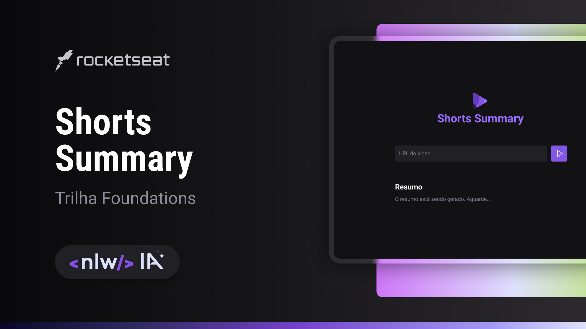

<h1 align="center"> Shorts Summary </h1>

<p align="center">
Projeto desenvolvido ao longo do evento NextLevelWeek IA da Rockseat<br/>

<p align="center">
  <a href="#-tecnologias">Tecnologias</a>&nbsp;&nbsp;&nbsp;|&nbsp;&nbsp;&nbsp;
  <a href="#-projeto">Projeto</a>&nbsp;&nbsp;&nbsp;|&nbsp;&nbsp;&nbsp;
  <a href="#-uso">Uso</a>&nbsp;&nbsp;&nbsp;|&nbsp;&nbsp;&nbsp;
  <a href="#memo-licença">Licença</a>
</p>

<p align="center">
  
</p>

<br>

<p align="center">
  
</p>

## 🚀 Tecnologias

Esse projeto foi desenvolvido com as seguintes tecnologias:

- HTML e CSS
- JavaScript e NodeJs
- Modelos de Inteligência Articial (https://huggingface.co/models)
- Vite
- Git e Github
- Figma

## 💻 Projeto

A aplicação Shorts Summary é um resumidor de vídeos curtos do youtube (shorts), que é realizada a transcrição do áudio do vídeo, logo após
o resumo dessa mesma transcrição utilizando um modelo de inteligência artificial, nesse caso foi utilizado o Xenova/transformers.js

## 🎯 Uso

Cole um link de um vídeo short do youtube e aguarde a transcrição e resumo

## 💾 Instalação

Siga os passos a seguir para executar o projeto na sua máquina

- Clone o repositório

```
git clone https://github.com/Hitalo-Lima/shorts-summary.git
```

- Instale as dependências do projeto

```
npm install
```

- Acesse o diretório do projeto

```
cd boarding-pass
```

- Rode o app

```
npm run server
npm run web

```

## 📝 Licença

Esse projeto está sob a licença MIT.
